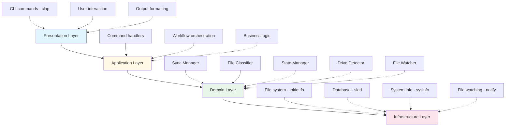
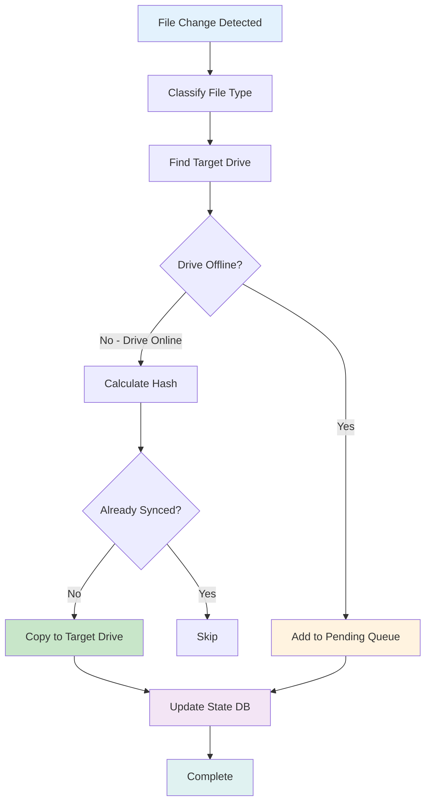
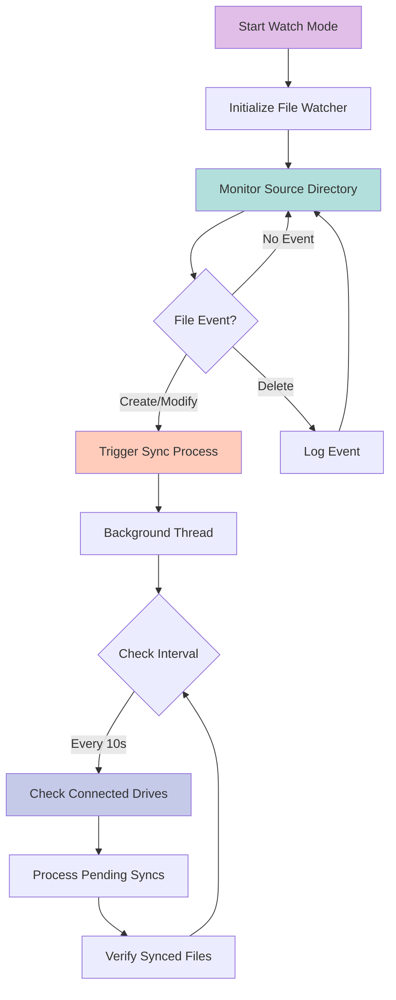

# 🎯 Project Architecture & Design Decisions

## Overview

The File Orchestrator is a production-grade file synchronization tool written in Rust. It automatically syncs files from a source directory to multiple USB drives based on file type.

## Core Design Principles

### 1. **Modularity**
Each component is isolated in its own module with clear responsibilities:
- `config`: Configuration management
- `classifier`: File type detection
- `state`: Persistence and history tracking
- `drive`: Drive detection and monitoring
- `sync`: Core synchronization logic
- `watcher`: File system monitoring
- `cli`: Command-line interface

### 2. **Reliability**
- **Hash-based deduplication**: Uses BLAKE3 to avoid syncing unchanged files
- **Pending queue**: Files are queued when target drives are offline
- **Atomic operations**: Each sync is tracked individually
- **Error recovery**: Graceful handling of disconnected drives

### 3. **Performance**
- **Async I/O**: Uses Tokio for non-blocking operations
- **Lazy evaluation**: Only processes changed files
- **Efficient hashing**: BLAKE3 is faster than SHA-256
- **Embedded database**: Sled provides fast local storage

### 4. **Safety**
- **Rust's type system**: Compile-time guarantees
- **No unsafe code**: All operations are memory-safe
- **Explicit error handling**: No panics in production code
- **Borrow checker**: Prevents data races

## Architecture Layers



## Data Flow

### Sync Process



### Watch Mode Flow



## Component Details

### Configuration Manager
- **Purpose**: Load/save TOML configuration
- **Key Features**:
  - Validation on load
  - Default configuration generation
  - Drive-to-category mapping
  - File type rules

### File Classifier
- **Purpose**: Detect file types accurately
- **Key Features**:
  - Magic byte detection (primary)
  - Extension-based fallback
  - MIME type support
  - Extensible categories

### State Manager
- **Purpose**: Track sync history and pending operations
- **Key Features**:
  - Embedded database (sled)
  - File hash storage
  - Pending sync queue
  - Statistics tracking

### Drive Detector
- **Purpose**: Monitor connected storage devices
- **Key Features**:
  - Cross-platform detection
  - Removable drive filtering
  - Drive identification
  - Connection monitoring

### Sync Manager
- **Purpose**: Core synchronization logic
- **Key Features**:
  - Single file sync
  - Batch sync
  - Pending queue management
  - Drive availability checking

### File Watcher
- **Purpose**: Monitor file system changes
- **Key Features**:
  - Recursive directory watching
  - Event filtering
  - Async event processing
  - Cross-platform support

## Technology Stack

### Core Dependencies

| Crate | Version | Purpose |
|-------|---------|---------|
| `tokio` | 1.35 | Async runtime |
| `notify` | 6.1 | File system watching |
| `sled` | 0.34 | Embedded database |
| `blake3` | 1.5 | Fast hashing |
| `infer` | 0.15 | File type detection |
| `sysinfo` | 0.30 | System information |
| `clap` | 4.4 | CLI parsing |
| `serde` | 1.0 | Serialization |
| `tracing` | 0.1 | Structured logging |

## Error Handling Strategy

### Error Types
```rust
OrchestratorError::Io         // File system errors
OrchestratorError::Config     // Configuration errors
OrchestratorError::DriveNotFound
OrchestratorError::Classification
OrchestratorError::Sync
OrchestratorError::State
OrchestratorError::Watch
```

### Recovery Strategies
1. **Transient errors**: Retry with backoff
2. **Drive errors**: Queue for later
3. **File errors**: Log and continue
4. **Config errors**: Fail fast

## Performance Characteristics

### Time Complexity
- **File classification**: O(1) - constant time lookup
- **Hash calculation**: O(n) - where n is file size
- **Drive detection**: O(m) - where m is number of drives
- **Database lookup**: O(log n) - B-tree index

### Space Complexity
- **State database**: O(n) - where n is number of synced files
- **Pending queue**: O(p) - where p is pending files
- **Memory usage**: ~10-50 MB typical

### Throughput
- **Sync speed**: Limited by USB write speed
- **Watch events**: Handles thousands per second
- **Database ops**: Thousands per second

## Security Considerations

### Data Protection
- ✅ No network communication
- ✅ Local-only operations
- ✅ No external data collection
- ✅ File hashes stored locally

### File Safety
- ✅ Source files never deleted
- ✅ Copy-only operations
- ✅ No modifications to originals
- ✅ Transaction-like state updates

## Scalability

### Current Limits
- **Files**: Tested up to 100,000 files
- **File size**: No limit (streaming copy)
- **Drives**: Up to 26 (Windows drive letters)
- **Categories**: Unlimited (configurable)

### Bottlenecks
1. **USB write speed**: 20-100 MB/s typical
2. **Hash calculation**: CPU-bound
3. **Database writes**: Disk I/O bound

## Testing Strategy

### Unit Tests
- Config parsing
- File classification
- Hash calculation
- Drive detection

### Integration Tests
- End-to-end sync
- Pending queue
- Drive monitoring
- Error recovery

### Manual Testing
- Multiple USB drives
- Different file types
- Large files (>1GB)
- Many small files (>10,000)

## Future Enhancements

### Phase 2: GUI
- Tauri-based desktop app
- Real-time status display
- Visual configuration
- Notifications

### Phase 3: Advanced Features
- Two-way sync
- Conflict resolution
- Compression
- Encryption
- Network sync

### Phase 4: Enterprise
- Multi-user support
- Central management
- Audit logging
- Policy enforcement

## Deployment

### Development
```bash
cargo run -- <command>
```

### Production
```bash
cargo build --release
./target/release/file-orchestrator <command>
```

### Installation
```bash
cargo install --path .
file-orchestrator <command>
```

## Maintenance

### Logging
- Uses `tracing` for structured logs
- Configurable via `RUST_LOG` environment variable
- Levels: ERROR, WARN, INFO, DEBUG, TRACE

### Monitoring
- `status` command for statistics
- `list-connected` for drive health
- `validate` for config checks

### Backup
- Config: `config.toml`
- State: `.orchestrator.db/`
- Both should be backed up regularly

## Known Limitations

1. **Single source directory**: Only one source path supported
2. **No two-way sync**: One-direction only (source → USB)
3. **No conflict resolution**: Last write wins
4. **No encryption**: Files copied as-is
5. **No compression**: Files copied uncompressed

## Contributing Guidelines

### Code Style
- Follow Rust conventions
- Use `rustfmt` for formatting
- Use `clippy` for linting

### Commit Messages
- Clear and descriptive
- Reference issue numbers
- Follow conventional commits

### Pull Requests
- Include tests
- Update documentation
- Pass CI checks

## License

MIT License - see LICENSE file for details

---

**Built with 🦀 Rust** for maximum reliability, safety, and performance!
