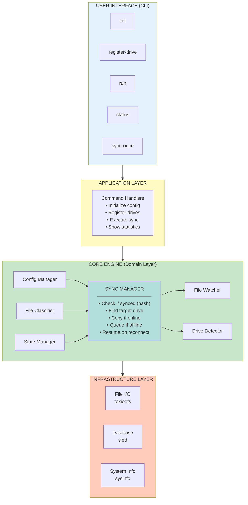
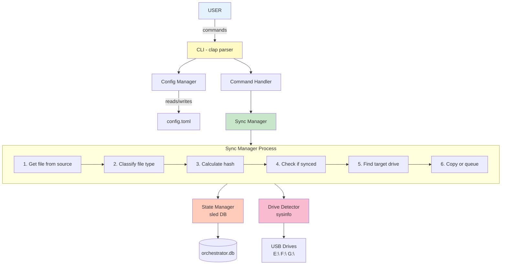
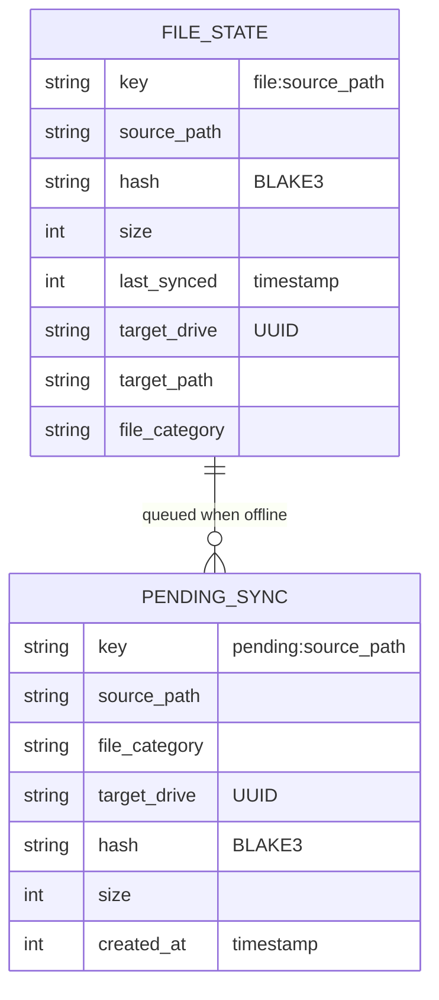
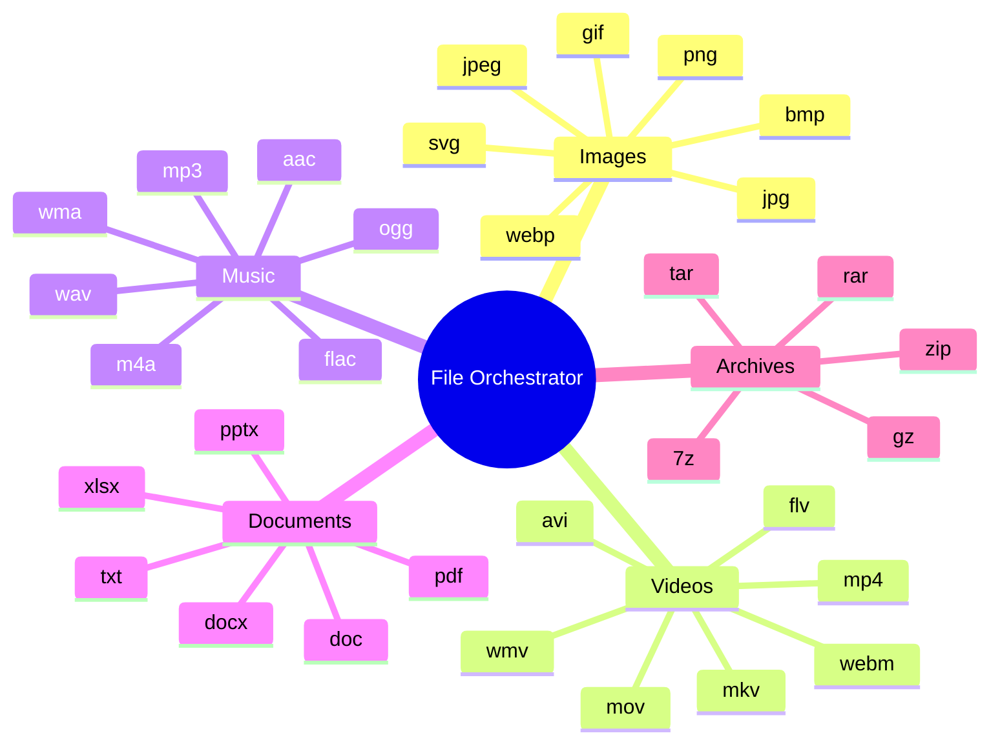
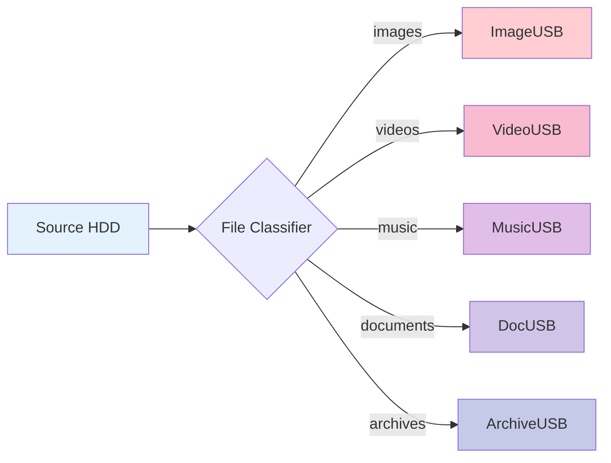
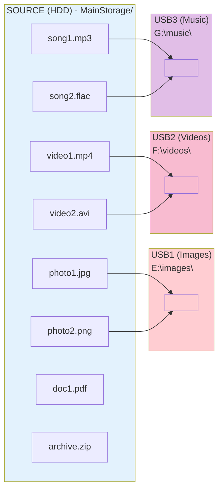
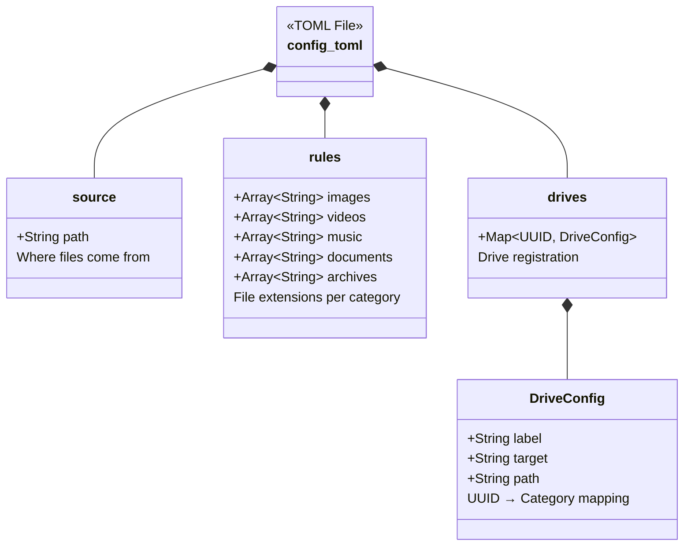
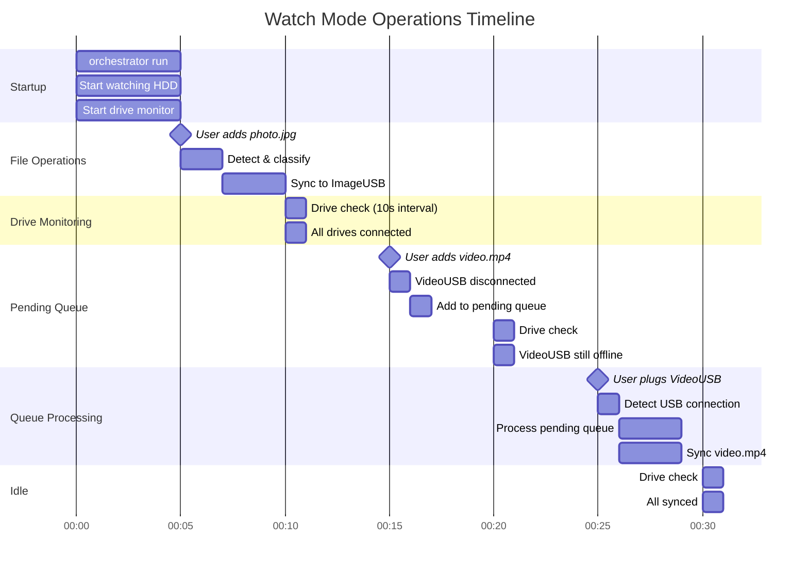

# 📊 Visual System Diagram

## 🎨 Complete System Overview



## 🔄 Data Flow Diagram



## 🎬 Sync Process Flow

```
┌─────────────────────────────────────────────────────────────────┐
│                     SYNC PROCESS                                 │
└─────────────────────────────────────────────────────────────────┘

  START
    │
    ▼
┌───────────────────┐
│ File Detected     │  ◄── File Watcher (notify)
│  photo.jpg        │      monitors HDD directory
└─────────┬─────────┘
          │
          ▼
┌───────────────────┐
│ Classify Type     │  ◄── infer crate reads
│  → Image          │      magic bytes (MIME)
└─────────┬─────────┘
          │
          ▼
┌───────────────────┐
│ Calculate Hash    │  ◄── BLAKE3 hashing
│  → abc123...      │      (fast & secure)
└─────────┬─────────┘
          │
          ▼
┌───────────────────┐
│ Already Synced?   │  ◄── Check sled database
└─────────┬─────────┘      for existing hash
          │
    ┌─────┴─────┐
    │           │
   YES         NO
    │           │
    ▼           ▼
┌────────┐  ┌──────────────────┐
│  SKIP  │  │ Find Target USB  │  ◄── Config lookup
└────────┘  │  → ImageUSB      │      images → USB1
            └─────────┬────────┘
                      │
                      ▼
            ┌──────────────────┐
            │ USB Connected?   │  ◄── Drive detector
            └─────────┬────────┘      checks sysinfo
                      │
                ┌─────┴─────┐
                │           │
               YES         NO
                │           │
                ▼           ▼
     ┌────────────────┐  ┌──────────────┐
     │  COPY FILE     │  │ ADD TO QUEUE │
     │  HDD → USB     │  │  (pending)   │
     └───────┬────────┘  └──────┬───────┘
             │                  │
             ▼                  │
     ┌────────────────┐         │
     │ Update State   │         │
     │ Save hash/path │         │
     └───────┬────────┘         │
             │                  │
             ▼                  │
          ┌──────┐              │
          │ DONE │              │
          └──────┘              │
                                │
                                ▼
                      ┌──────────────────┐
                      │ Wait for USB     │
                      │ reconnection...  │
                      └────────┬─────────┘
                               │
                               │ USB plugged in!
                               ▼
                      ┌──────────────────┐
                      │ Process Queue    │
                      │ Sync all pending │
                      └────────┬─────────┘
                               │
                               ▼
                            ┌──────┐
                            │ DONE │
                            └──────┘
```

## 🗄️ State Database Schema



**Example Records:**

**FileState:**
```json
{
  "key": "file:C:\\MainStorage\\photo.jpg",
  "source_path": "C:\\MainStorage\\photo.jpg",
  "hash": "abc123def456...",
  "size": 1048576,
  "last_synced": 1699545600,
  "target_drive": "uuid-1234-5678",
  "target_path": "E:\\images\\photo.jpg",
  "file_category": "images"
}
```

**PendingSync:**
```json
{
  "key": "pending:C:\\MainStorage\\video.mp4",
  "source_path": "C:\\MainStorage\\video.mp4",
  "file_category": "videos",
  "target_drive": "uuid-9876-5432",
  "hash": "xyz789abc...",
  "size": 52428800,
  "created_at": 1699545700
}
```

## 📁 File Category Mapping



**Drive Assignment:**


**File Type → USB Mapping:**


## ⚙️ Configuration Structure



**Example config.toml:**
```toml
[source]
path = "D:/MainStorage"  # Where files come from

[rules]
images = ["jpg", "png", "gif", "bmp"]  # File extensions
videos = ["mp4", "avi", "mov", "mkv"]  # per category
music  = ["mp3", "wav", "flac", "aac"]

[drives.d158faad-4337-4eeb-a06f-94434eca6d91]
label = "ImageUSB"     # Drive registration
target = "images"      # UUID → Category mapping
path = "E:/"           # Use forward slash
```

## 🔍 Watch Mode Timeline



## 🎯 Summary

This visual documentation shows:
- ✅ System architecture (layered design)
- ✅ Data flow (from user to disk)
- ✅ Sync process (step-by-step)
- ✅ Database schema (state storage)
- ✅ File mapping (category routing)
- ✅ Configuration (TOML structure)
- ✅ Watch mode timeline (real-time operations)

---

**These diagrams help visualize the complete system! 🎨**
