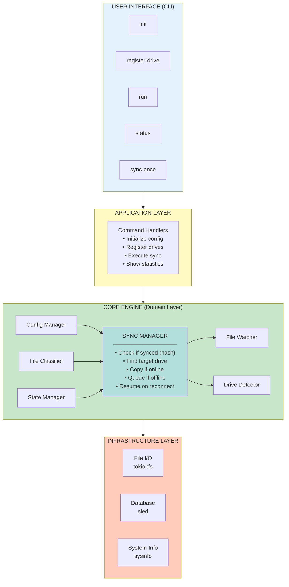
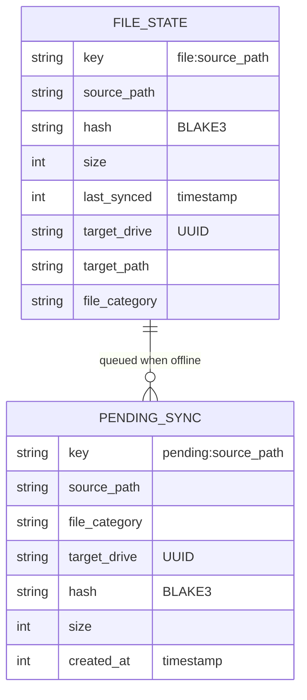
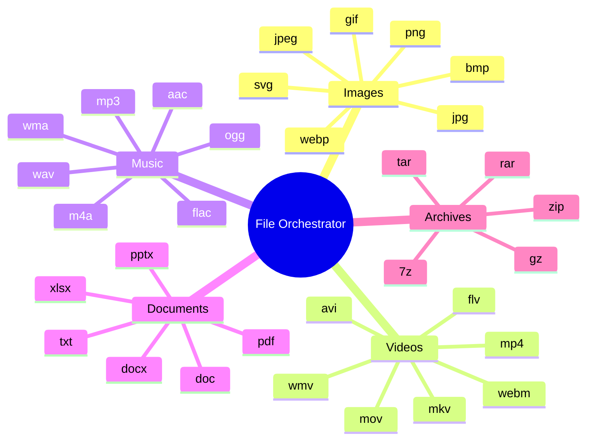
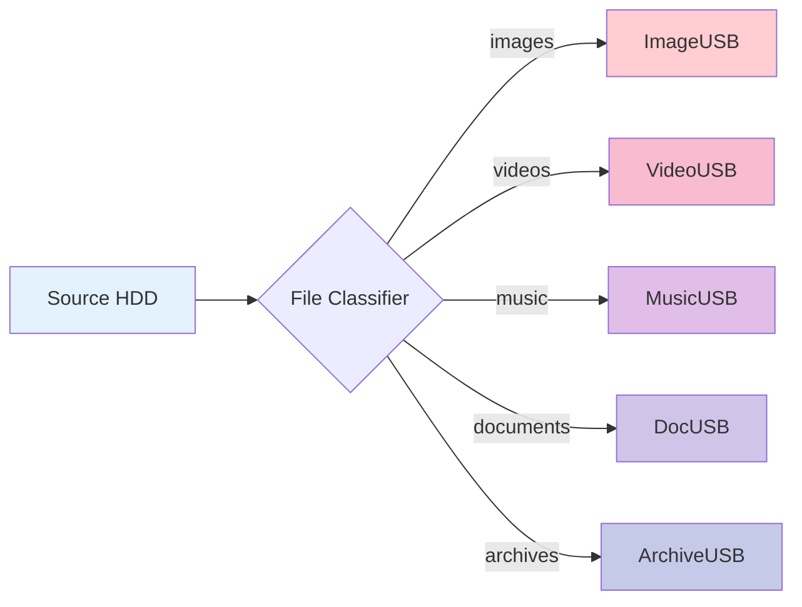

# 📊 Visual System Diagram

## 🎨 Complete System Overview



## 🔄 Data Flow Diagram

```
                          ┌─────────────┐
                          │    USER     │
                          └──────┬──────┘
                                 │
                                 │ commands
                                 ▼
                    ┌────────────────────────┐
                    │   CLI (clap parser)    │
                    └───────────┬────────────┘
                                │
                    ┌───────────┴────────────┐
                    │                        │
                    ▼                        ▼
        ┌──────────────────┐    ┌──────────────────┐
        │  Command Handler │    │  Config Manager  │
        └────────┬─────────┘    └────────┬─────────┘
                 │                       │
                 │                       ▼
                 │              ┌────────────────┐
                 │              │  config.toml   │
                 │              └────────────────┘
                 │
                 ▼
        ┌───────────────────────────────┐
        │      Sync Manager             │
        │  ┌─────────────────────────┐  │
        │  │ 1. Get file from source │  │
        │  │ 2. Classify file type   │  │
        │  │ 3. Calculate hash       │  │
        │  │ 4. Check if synced      │  │
        │  │ 5. Find target drive    │  │
        │  │ 6. Copy or queue        │  │
        │  └─────────────────────────┘  │
        └───┬───────────────────────┬───┘
            │                       │
            ▼                       ▼
   ┌────────────────┐      ┌────────────────┐
   │ State Manager  │      │ Drive Detector │
   │  (sled DB)     │      │  (sysinfo)     │
   └────────────────┘      └────────────────┘
            │                       │
            ▼                       ▼
   ┌────────────────┐      ┌────────────────┐
   │ .orchestrator  │      │ USB Drives     │
   │     .db/       │      │  E:\ F:\ G:\   │
   └────────────────┘      └────────────────┘
```

## 🎬 Sync Process Flow

```
┌─────────────────────────────────────────────────────────────────┐
│                     SYNC PROCESS                                 │
└─────────────────────────────────────────────────────────────────┘

  START
    │
    ▼
┌───────────────────┐
│ File Detected     │  ◄── File Watcher (notify)
│  photo.jpg        │      monitors HDD directory
└─────────┬─────────┘
          │
          ▼
┌───────────────────┐
│ Classify Type     │  ◄── infer crate reads
│  → Image          │      magic bytes (MIME)
└─────────┬─────────┘
          │
          ▼
┌───────────────────┐
│ Calculate Hash    │  ◄── BLAKE3 hashing
│  → abc123...      │      (fast & secure)
└─────────┬─────────┘
          │
          ▼
┌───────────────────┐
│ Already Synced?   │  ◄── Check sled database
└─────────┬─────────┘      for existing hash
          │
    ┌─────┴─────┐
    │           │
   YES         NO
    │           │
    ▼           ▼
┌────────┐  ┌──────────────────┐
│  SKIP  │  │ Find Target USB  │  ◄── Config lookup
└────────┘  │  → ImageUSB      │      images → USB1
            └─────────┬────────┘
                      │
                      ▼
            ┌──────────────────┐
            │ USB Connected?   │  ◄── Drive detector
            └─────────┬────────┘      checks sysinfo
                      │
                ┌─────┴─────┐
                │           │
               YES         NO
                │           │
                ▼           ▼
     ┌────────────────┐  ┌──────────────┐
     │  COPY FILE     │  │ ADD TO QUEUE │
     │  HDD → USB     │  │  (pending)   │
     └───────┬────────┘  └──────┬───────┘
             │                  │
             ▼                  │
     ┌────────────────┐         │
     │ Update State   │         │
     │ Save hash/path │         │
     └───────┬────────┘         │
             │                  │
             ▼                  │
          ┌──────┐              │
          │ DONE │              │
          └──────┘              │
                                │
                                ▼
                      ┌──────────────────┐
                      │ Wait for USB     │
                      │ reconnection...  │
                      └────────┬─────────┘
                               │
                               │ USB plugged in!
                               ▼
                      ┌──────────────────┐
                      │ Process Queue    │
                      │ Sync all pending │
                      └────────┬─────────┘
                               │
                               ▼
                            ┌──────┐
                            │ DONE │
                            └──────┘
```

## 🗄️ State Database Schema



**Example Records:**

**FileState:**
```json
{
  "key": "file:C:\\MainStorage\\photo.jpg",
  "source_path": "C:\\MainStorage\\photo.jpg",
  "hash": "abc123def456...",
  "size": 1048576,
  "last_synced": 1699545600,
  "target_drive": "uuid-1234-5678",
  "target_path": "E:\\images\\photo.jpg",
  "file_category": "images"
}
```

**PendingSync:**
```json
{
  "key": "pending:C:\\MainStorage\\video.mp4",
  "source_path": "C:\\MainStorage\\video.mp4",
  "file_category": "videos",
  "target_drive": "uuid-9876-5432",
  "hash": "xyz789abc...",
  "size": 52428800,
  "created_at": 1699545700
}
```

## 📁 File Category Mapping



**Drive Assignment:**

┌──────────────────────────────────────────────────────────────┐
│                   FILE TYPE → USB MAPPING                     │
└──────────────────────────────────────────────────────────────┘

    SOURCE (HDD)                         TARGET (USB)
┌───────────────────┐              ┌──────────────────┐
│   MainStorage/    │              │                  │
│                   │              │                  │
│  ├─ photo1.jpg    │─────────────►│  USB1 (Images)   │
│  ├─ photo2.png    │─────────────►│   E:\images\     │
│  │                │              │                  │
│  ├─ video1.mp4    │─────┐        └──────────────────┘
│  ├─ video2.avi    │─────┤
│  │                │     │        ┌──────────────────┐
│  ├─ song1.mp3     │─────┼───────►│  USB2 (Videos)   │
│  ├─ song2.flac    │─────┼───┐    │   F:\videos\     │
│  │                │     │   │    │                  │
│  ├─ doc1.pdf      │─────┼───┼───►└──────────────────┘
│  └─ archive.zip   │     │   │
│                   │     └───┼───►┌──────────────────┐
└───────────────────┘         │    │  USB3 (Music)    │
                              │    │   G:\music\      │
                              │    │                  │
                              └───►└──────────────────┘
```

## ⚙️ Configuration Structure

```
┌─────────────────────────────────────────────────────────────┐
│                      config.toml                             │
├─────────────────────────────────────────────────────────────┤
│                                                              │
│  [source]                                                    │
│  path = "D:/MainStorage"  ◄── Where files come from        │
│                                                              │
│  [rules]                                                     │
│  images = ["jpg", "png", ...]  ◄── File extensions         │
│  videos = ["mp4", "avi", ...]      per category             │
│  music  = ["mp3", "wav", ...]                               │
│                                                              │
│  [drives]                                                    │
│  "uuid-1234" = {            ◄── Drive registration         │
│    label = "ImageUSB",          UUID → Category mapping     │
│    target = "images",                                        │
│    path = "E:\"                                              │
│  }                                                           │
│  "uuid-5678" = { ... }                                      │
│                                                              │
└─────────────────────────────────────────────────────────────┘
```

## 🔍 Watch Mode Timeline

```
TIME  │  EVENT                          │  ACTION
──────┼─────────────────────────────────┼────────────────────
00:00 │  orchestrator run               │  Start watching HDD
      │                                 │  Start drive monitor
──────┼─────────────────────────────────┼────────────────────
00:05 │  User adds photo.jpg            │  Detect new file
      │                                 │  Classify as image
      │                                 │  Sync to ImageUSB
──────┼─────────────────────────────────┼────────────────────
00:10 │  Drive check (interval)         │  Check all USBs
      │  All drives connected           │  No action needed
──────┼─────────────────────────────────┼────────────────────
00:15 │  User adds video.mp4            │  Detect new file
      │  VideoUSB disconnected          │  Add to pending queue
──────┼─────────────────────────────────┼────────────────────
00:20 │  Drive check                    │  VideoUSB still offline
      │                                 │  Keep in queue
──────┼─────────────────────────────────┼────────────────────
00:25 │  User plugs in VideoUSB         │  Detect USB connection
      │                                 │  Process pending queue
      │                                 │  Sync video.mp4
──────┼─────────────────────────────────┼────────────────────
00:30 │  Drive check                    │  All synced, no action
──────┼─────────────────────────────────┼────────────────────
```

## 🎯 Summary

This visual documentation shows:
- ✅ System architecture (layered design)
- ✅ Data flow (from user to disk)
- ✅ Sync process (step-by-step)
- ✅ Database schema (state storage)
- ✅ File mapping (category routing)
- ✅ Configuration (TOML structure)
- ✅ Watch mode timeline (real-time operations)

---

**These diagrams help visualize the complete system! 🎨**
