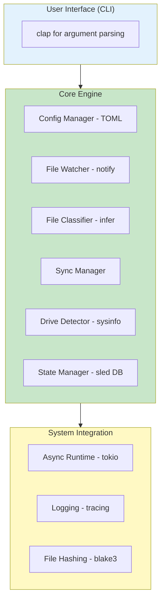

# 🗂️ File Orchestrator

A production-grade file orchestration tool written in Rust for automatic file synchronization across multiple storage devices.

## 🎯 Features

- **🔍 Intelligent File Classification**: Uses magic bytes (MIME types) to accurately detect file types
- **🔄 Automatic Syncing**: Real-time file watching and automatic synchronization
- **💾 Smart State Management**: Tracks sync history using BLAKE3 hashing to avoid duplicate syncs
- **📦 Pending Queue**: Queues files when target drives are offline, syncs automatically when reconnected
- **🖥️ Cross-Platform**: Works on Windows, Linux, and macOS
- **⚡ High Performance**: Built with async Rust (Tokio) for efficient file operations
- **📊 Statistics & Monitoring**: Track sync status, file counts, and storage usage

## 🏗️ Architecture



## 📋 Prerequisites

- Rust 1.70+ (install from [rustup.rs](https://rustup.rs))
- Cargo (comes with Rust)

## 🚀 Installation

### Quick Start (Recommended)

```bash
# Clone the repository (or create from this folder)
cd orchestrator

# Run the startup script - it will check dependencies and install
./start.sh

# Select option 1 to install globally
# After installation, you can use 'fo' command from anywhere!
```

### Manual Installation

```bash
# Build the project
cargo build --release

# The binary will be in target/release/fo

# Install globally:
cargo install --path .
```

## 📖 Usage

### 1. Initialize Configuration

```bash
# Create a default configuration file
fo init

# This creates config.toml in the current directory
```

### 2. Edit Configuration

Edit `config.toml` to set your source directory:

```toml
[source]
path = "/path/to/your/MainStorage"  # Your main storage path

[rules]
images = ["jpg", "jpeg", "png", "gif", "bmp", "webp", "svg"]
videos = ["mp4", "avi", "mov", "mkv", "flv", "wmv", "webm"]
music  = ["mp3", "wav", "flac", "aac", "ogg", "m4a", "wma"]
documents = ["pdf", "doc", "docx", "txt", "xlsx", "pptx"]
archives = ["zip", "rar", "7z", "tar", "gz"]

[drives]
# Drives will be added via the register-drive command
```

### 3. Register Your USB Drives

```bash
# List currently connected drives to see available drives
fo list-connected

# Register a USB drive - the system will show you available drives and let you select one
fo register-drive --label "ImageUSB" --category images

# Example output:
# === Available Drives ===
# 1. Windows - C:\ (161 GB available)
# 2. USB - D:\ (7 GB available)
# ========================
# 
# Which drive do you want to register as 'ImageUSB'?
# Enter number (or press Enter to skip auto-detection): 2
#
# ✓ Registered drive:
#   Label: ImageUSB
#   Category: images
#   UUID: d158faad-4337-4eeb-a06f-94434eca6d91
#   Path: D:\

# Register more drives for different categories
fo register-drive --label "VideoUSB" --category videos
fo register-drive --label "MusicUSB" --category music

# Or specify the path manually if needed
fo register-drive --label "MyUSB" --category images --path "/path/to/usb"

# List registered drives to verify
fo list-drives
```

### 4. Run the Orchestrator

#### Watch Mode (Continuous Monitoring)

```bash
# Start the orchestrator in watch mode
fo run

# With custom interval for checking drives (default: 10 seconds)
fo run --interval 30
```

#### One-Time Sync

```bash
# Sync all files once
fo sync-once

# Sync a specific file
fo sync-once --file "/path/to/MainStorage/photo.jpg"
```

### 5. Monitor Status

```bash
# Check sync status and statistics
fo status

# Process pending syncs manually
fo process-pending
```

## 🔧 Commands Reference

| Command | Description | Example |
|---------|-------------|---------|
| `init` | Create a default configuration file | `fo init` |
| `register-drive` | Register a USB drive for a file category | `fo register-drive --label "MyUSB" --category images` |
| `list-drives` | List all registered drives | `fo list-drives` |
| `list-connected` | List currently connected drives | `fo list-connected` |
| `sync-once` | Perform a one-time sync | `fo sync-once` |
| `run` | Start in watch mode | `fo run` |
| `status` | Show sync statistics | `fo status` |
| `process-pending` | Process queued syncs | `fo process-pending` |
| `validate` | Validate configuration file | `fo validate` |
| `clear` | Clear all sync history | `fo clear --confirm` |

## 📁 Project Structure

```
orchestrator/
├── src/
│   ├── main.rs              # Application entry point
│   ├── error.rs             # Error types and handling
│   ├── cli/
│   │   └── mod.rs           # CLI interface (clap)
│   ├── config/
│   │   └── mod.rs           # Configuration management
│   ├── classifier/
│   │   └── mod.rs           # File type detection
│   ├── state/
│   │   └── mod.rs           # State management & hashing
│   ├── drive/
│   │   └── mod.rs           # Drive detection & monitoring
│   ├── sync/
│   │   └── mod.rs           # Sync logic (core engine)
│   └── watcher/
│       └── mod.rs           # File system watching
├── Cargo.toml               # Dependencies
└── README.md                # This file
```

## 🔄 How It Works

1. **File Watching**: Monitors your source directory for file changes using the `notify` crate
2. **Classification**: When a new/modified file is detected, it's classified by type using magic bytes
3. **Drive Matching**: Looks up which USB drive handles that file type
4. **Sync or Queue**:
   - If the target drive is connected → copies the file immediately
   - If offline → adds to pending queue
5. **Hash Tracking**: Uses BLAKE3 to hash files and prevent duplicate syncs
6. **Auto-Resume**: When a USB is reconnected, automatically syncs all pending files

## 🛠️ Configuration

### File Categories

The tool supports these default categories:
- **images**: Photos, graphics (jpg, png, gif, etc.)
- **videos**: Movies, clips (mp4, avi, mkv, etc.)
- **music**: Audio files (mp3, wav, flac, etc.)
- **documents**: PDFs, office docs (pdf, docx, xlsx, etc.)
- **archives**: Compressed files (zip, rar, 7z, etc.)

### Custom Rules

You can customize file type rules in `config.toml`:

```toml
[rules]
images = ["jpg", "png", "heic", "raw"]
videos = ["mp4", "mov"]
music = ["mp3", "flac"]
```

## 🧪 Testing

```bash
# Run all tests
cargo test

# Run with output
cargo test -- --nocapture

# Run specific test
cargo test test_file_classifier
```

## 🐛 Troubleshooting

### Issue: Drive not detected

**Solution**: Use `fo list-connected` to see all drives and their mount points. Then register the drive with the exact label or path.

### Issue: Files not syncing

**Solution**: 
1. Check `fo status` to see pending syncs
2. Verify drive is connected: `fo list-connected`
3. Check logs for errors (run with `RUST_LOG=debug`)

### Issue: Permission errors

**Solution**: Ensure you have read permissions on source directory and write permissions on target USB drives.

## 📊 Performance

- **Hashing**: Uses BLAKE3 (faster than SHA-256)
- **Async I/O**: Non-blocking file operations via Tokio
- **Efficient Watching**: Only processes actual file changes
- **Minimal Overhead**: Embedded database (sled) with no external dependencies

## 🔐 Security Considerations

- File hashes are stored locally in `.orchestrator.db`
- No network communication
- No external data collection
- All operations are local to your machine

## 🗺️ Roadmap

- [ ] **Phase 1**: Core sync logic ✅ (Current)
- [ ] **Phase 2**: GUI interface (Tauri or egui)
- [ ] **Phase 3**: Two-way sync support
- [ ] **Phase 4**: Network/remote sync (SSH, cloud)
- [ ] **Phase 5**: Compression before transfer
- [ ] **Phase 6**: Encryption support
- [ ] **Phase 7**: Mobile app integration

## 📝 Example Workflow

```bash
# Day 1: Setup
fo init
# Edit config.toml to set source path
fo register-drive --label "Photos" --category images
fo run

# Day 2: USB is unplugged
# Tool queues new photos automatically

# Day 3: Plug USB back in
# Tool detects USB and syncs all pending photos automatically

# Anytime: Check status
fo status
```

## 🤝 Contributing

Contributions are welcome! Please feel free to submit issues or pull requests.

## 📄 License

MIT License - feel free to use this in your own projects!

## 🙏 Acknowledgments

Built with these amazing Rust crates:
- `tokio` - Async runtime
- `notify` - File system watching
- `sled` - Embedded database
- `infer` - File type detection
- `blake3` - Fast hashing
- `clap` - CLI parsing
- `sysinfo` - System information
- `tracing` - Logging

---

**Made with 🦀 Rust**
