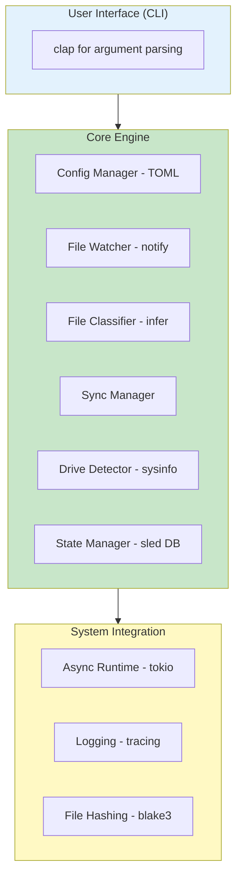

# File Orchestrator

Automatic file synchronization tool for USB drives. Written in Rust.

## Features

- **🔍 Intelligent File Classification**: Uses magic bytes (MIME types) to accurately detect file types
- **🔄 Automatic Syncing**: Real-time file watching and automatic synchronization
- **💾 Smart State Management**: Tracks sync history using BLAKE3 hashing to avoid duplicate syncs
- **📦 Pending Queue**: Queues files when target drives are offline, syncs automatically when reconnected
- **🖥️ Cross-Platform**: Works on Windows, Linux, and macOS
- **⚡ High Performance**: Built with async Rust (Tokio) for efficient file operations
- **📊 Statistics & Monitoring**: Track sync status, file counts, and storage usage

## 🏗️ Architecture



## 📋 Prerequisites

- Rust 1.70+ (install from [rustup.rs](https://rustup.rs))
- Cargo (comes with Rust)

## 🚀 Installation

### From Source

```bash
# Clone the repository (or create from this folder)
cd orchestrator

# Build the project
cargo build --release

# The binary will be in target/release/file-orchestrator
# Optionally, install it globally:
cargo install --path .
```

## 📖 Usage

### 1. Initialize Configuration

```bash
# Create a default configuration file
file-orchestrator init

# This creates config.toml in the current directory
```

### 2. Edit Configuration

Edit `config.toml` to set your source directory:

```toml
[source]
path = "D:/MainStorage"  # Your HDD path

[rules]
images = ["jpg", "jpeg", "png", "gif", "bmp", "webp", "svg"]
videos = ["mp4", "avi", "mov", "mkv", "flv", "wmv", "webm"]
music  = ["mp3", "wav", "flac", "aac", "ogg", "m4a", "wma"]
documents = ["pdf", "doc", "docx", "txt", "xlsx", "pptx"]
archives = ["zip", "rar", "7z", "tar", "gz"]

[drives]
# Drives will be added via the register-drive command
```

### 3. Register Your USB Drives

```bash
# List currently connected drives to see available drives
file-orchestrator list-connected

# Register a USB drive - the system will show you available drives and let you select one
file-orchestrator register-drive --label "ImageUSB" --category images

# Example output:
# === Available Drives ===
# 1. Windows - C:\ (161 GB available)
# 2. USB - D:\ (7 GB available)
# ========================
# 
# Which drive do you want to register as 'ImageUSB'?
# Enter number (or press Enter to skip auto-detection): 2
#
# ✓ Registered drive:
#   Label: ImageUSB
#   Category: images
#   UUID: d158faad-4337-4eeb-a06f-94434eca6d91
#   Path: D:\

# Register more drives for different categories
file-orchestrator register-drive --label "VideoUSB" --category videos
file-orchestrator register-drive --label "MusicUSB" --category music

# Or specify the path manually if needed
file-orchestrator register-drive --label "MyUSB" --category images --path "E:/"

# List registered drives to verify
file-orchestrator list-drives
```

### 4. Run the Orchestrator

#### Watch Mode (Continuous Monitoring)

```bash
# Start the orchestrator in watch mode
file-orchestrator run

# With custom interval for checking drives (default: 10 seconds)
file-orchestrator run --interval 30
```

#### One-Time Sync

```bash
# Sync all files once
file-orchestrator sync-once

# Sync a specific file
file-orchestrator sync-once --file "D:/MainStorage/photo.jpg"
```

### 5. Monitor Status

```bash
# Check sync status and statistics
file-orchestrator status

# Process pending syncs manually
file-orchestrator process-pending
```

## 🔧 Commands Reference

| Command | Description | Example |
|---------|-------------|---------|
| `init` | Create a default configuration file | `file-orchestrator init` |
| `register-drive` | Register a USB drive for a file category | `file-orchestrator register-drive --label "MyUSB" --category images` |
| `list-drives` | List all registered drives | `file-orchestrator list-drives` |
| `list-connected` | List currently connected drives | `file-orchestrator list-connected` |
| `sync-once` | Perform a one-time sync | `file-orchestrator sync-once` |
| `run` | Start in watch mode | `file-orchestrator run` |
| `status` | Show sync statistics | `file-orchestrator status` |
| `process-pending` | Process queued syncs | `file-orchestrator process-pending` |
| `validate` | Validate configuration file | `file-orchestrator validate` |
| `clear` | Clear all sync history | `file-orchestrator clear --confirm` |

## 📁 Project Structure

```
orchestrator/
├── src/
│   ├── main.rs              # Application entry point
│   ├── error.rs             # Error types and handling
│   ├── cli/
│   │   └── mod.rs           # CLI interface (clap)
│   ├── config/
│   │   └── mod.rs           # Configuration management
│   ├── classifier/
│   │   └── mod.rs           # File type detection
│   ├── state/
│   │   └── mod.rs           # State management & hashing
│   ├── drive/
│   │   └── mod.rs           # Drive detection & monitoring
│   ├── sync/
│   │   └── mod.rs           # Sync logic (core engine)
│   └── watcher/
│       └── mod.rs           # File system watching
├── Cargo.toml               # Dependencies
└── README.md                # This file
```

## 🔄 How It Works

1. **File Watching**: Monitors your source directory for file changes using the `notify` crate
2. **Classification**: When a new/modified file is detected, it's classified by type using magic bytes
3. **Drive Matching**: Looks up which USB drive handles that file type
4. **Sync or Queue**:
   - If the target drive is connected → copies the file immediately
   - If offline → adds to pending queue
5. **Hash Tracking**: Uses BLAKE3 to hash files and prevent duplicate syncs
6. **Auto-Resume**: When a USB is reconnected, automatically syncs all pending files

## 🛠️ Configuration

### File Categories

The tool supports these default categories:
- **images**: Photos, graphics (jpg, png, gif, etc.)
- **videos**: Movies, clips (mp4, avi, mkv, etc.)
- **music**: Audio files (mp3, wav, flac, etc.)
- **documents**: PDFs, office docs (pdf, docx, xlsx, etc.)
- **archives**: Compressed files (zip, rar, 7z, etc.)

### Custom Rules

You can customize file type rules in `config.toml`:

```toml
[source]
path = "/home/user/MainStorage"

[rules]
images = ["jpg", "png", "gif"]
videos = ["mp4", "mkv", "avi"]
music = ["mp3", "flac", "wav"]
documents = ["pdf", "docx", "txt"]
archives = ["zip", "rar", "7z"]
```

## File Categories

- **images**: Photos and graphics
- **videos**: Video files
- **music**: Audio files
- **documents**: PDFs, office docs
- **archives**: Compressed files

## How It Works

1. Watches your storage folder for new files
2. Classifies files by type (using magic bytes)
3. Syncs to registered USB drive for that category
4. Queues files if drive is offline
5. Auto-syncs when drive reconnects

## Troubleshooting

**Drive not detected**
```bash
# Run all tests
cargo test

# Run with output
cargo test -- --nocapture

# Run specific test
cargo test test_file_classifier
```

## 🐛 Troubleshooting

### Issue: Drive not detected

**Solution**: Use `file-orchestrator list-connected` to see all drives and their mount points. Then register the drive with the exact label or path.

### Issue: Files not syncing

**Solution**: 
1. Check `file-orchestrator status` to see pending syncs
2. Verify drive is connected: `file-orchestrator list-connected`
3. Check logs for errors (run with `RUST_LOG=debug`)

### Issue: Permission errors

**Solution**: Ensure you have read permissions on source directory and write permissions on target USB drives.

## 📊 Performance

- **Hashing**: Uses BLAKE3 (faster than SHA-256)
- **Async I/O**: Non-blocking file operations via Tokio
- **Efficient Watching**: Only processes actual file changes
- **Minimal Overhead**: Embedded database (sled) with no external dependencies

## 🔐 Security Considerations

- File hashes are stored locally in `.orchestrator.db`
- No network communication
- No external data collection
- All operations are local to your machine

## 🗺️ Roadmap

- [ ] **Phase 1**: Core sync logic ✅ (Current)
- [ ] **Phase 2**: GUI interface (Tauri or egui)
- [ ] **Phase 3**: Two-way sync support
- [ ] **Phase 4**: Network/remote sync (SSH, cloud)
- [ ] **Phase 5**: Compression before transfer
- [ ] **Phase 6**: Encryption support
- [ ] **Phase 7**: Mobile app integration

## 📝 Example Workflow

```bash
# Day 1: Setup
file-orchestrator init
# Edit config.toml to set source path
file-orchestrator register-drive --label "Photos" --category images
file-orchestrator run

# Day 2: USB is unplugged
# Tool queues new photos automatically

# Day 3: Plug USB back in
# Tool detects USB and syncs all pending photos automatically

# Anytime: Check status
file-orchestrator status
```

## 🤝 Contributing

Contributions are welcome! Please feel free to submit issues or pull requests.

## 📄 License

MIT License - feel free to use this in your own projects!

## 🙏 Acknowledgments

Built with these amazing Rust crates:
- `tokio` - Async runtime
- `notify` - File system watching
- `sled` - Embedded database
- `infer` - File type detection
- `blake3` - Fast hashing
- `clap` - CLI parsing
- `sysinfo` - System information
- `tracing` - Logging

---

**Made with 🦀 Rust**
